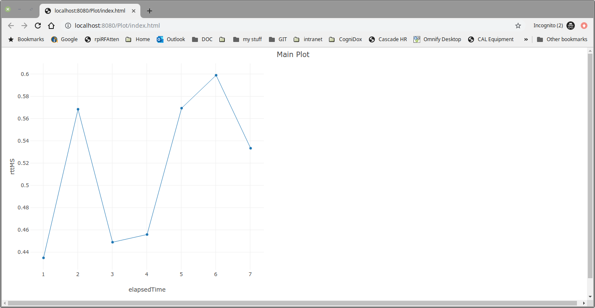
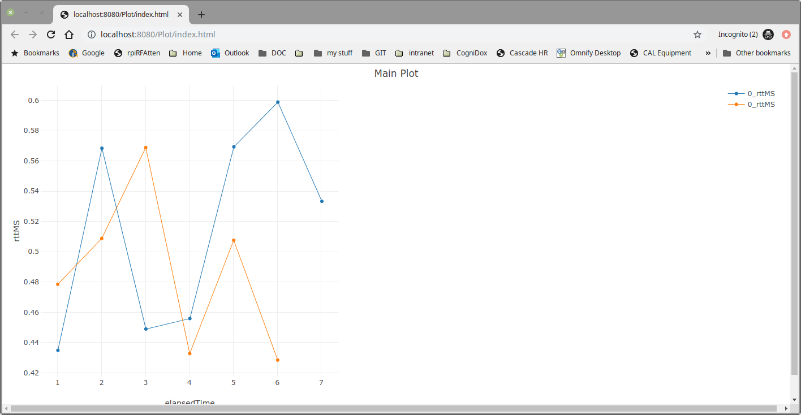
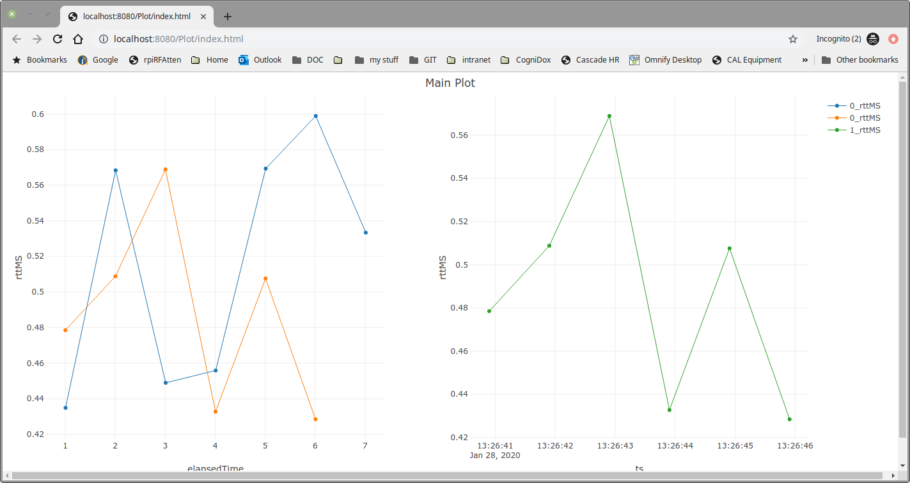

## Plot Tool
This is a companion tool to netplot that allows the user to read the contents of
an sqlite database and plot fields against each other on time series or x/y plots.
The main netplot tool is useful for plotting real time data but is not so good
for larger data sets (> 5000 plot points). Plottool allows larger data sets
to be plotted. PlotTool uses the plotly (https://plot.ly/) javascript
library to display the plots in a web browser.

## Using plottool
Plottool (plottool.py) allows the user to build complex plots one trace at a
time from data held in an sqlite database. Plottool incorporates a web server
that allows the user to open a web page using a web browser to view the plot.
The web server built into Plottool does not have to be used to serve the
web pages to view the plots as other web servers (E.G Apache) can be used
to view the plots by service the root path of Plottool.

The following is the command line help for plottool.
```
./plottool.py -h
Usage: A tool to allow data in an sqllite database to be plotted easily.

Options:
  -h, --help     show this help message and exit
  --create       Create Plot.
  --append       Append to an existing plot.
  -f F           The sqlite database file.
  -t T           The database table to plot data from.
  -l L           A comma separated list of two field names. The first is the X
                 value, the seconds is the Y value.
  -n N           The plot name (default=Plot).
  -m M           Max plot points (default=50000)
  --pg=PG        Plot grid (default = 1,1 I.E a single graph).
  --pgi=PGI      The plot grid index (default = 0).
  --log          Set a Log Y axis.
  --lw=LW        Define the trace line width (default=1.0)
  --dash         Set the trace line to a dashed line.
  --start=START  A start time for plot records (format = 2020-01-24
                 04:11:55.845981 of part of, E.G 2020-01-24).
  --stop=STOP    A stop time to plot records (format as above).
  --title=TITLE  The title of the plot (default = MAIN_PLOT).
  --show         Show the database schema. Shows each tables and the fields
                 available in each table.
  --ws           Run the web server. Use this if you wish to view an existing
                 plot.
  --port=PORT    The web server port (default=8080)
  --debug        Enable debugging.
```

### Steps to create a plot
 **View the fields available in the database**
 The first thing you need to know is what fields are available to be plotted. The following command can be used to read the database and show the tables and fields (database schema) that it contains. The database used contains data from a network ping tool.
```
./plottool.py -f /home/pja/local/pinger.db.long -t PingerData --show
INFO:  Connecting to /home/pja/local/pinger.db.long
INFO:  Connected.
INFO:  TABLE: PingerData
INFO:        1: ts
INFO:        2: elapsedTime
INFO:        3: pingDest
INFO:        4: txPacketCount
INFO:        5: rxPacketCount
INFO:        6: rttMS
INFO:        7: maxRTTMS
INFO:        8: minRTTMS
INFO:        9: pingTimeoutCount
INFO:       10: interPktDlyMS
INFO:       11: maxInterPktDlyMS
INFO:       12: minInterPktDlyMS
INFO:       13: lostPktCount
INFO:       14: percentageLostPktCount
INFO:       15: ipPacketSize
INFO:       16: ipPktRXMbps
INFO:       17: ethPktRXMbps
```

 **Create the plot grid and add first trace**
 Plottool allows multiple graphs to be displayed on one web page in a grid layout. The example command (below) creates a plot (grid = 1 row, 2 columns) recording the elapsed test time against the ping round trip time.
```
./plottool.py -f /tmp/pinger.db -t PingerData --create --pg 1,2 -l elapsedTime,rttMS
INFO:  Connecting to /tmp/pinger.db
INFO:  Connected.
INFO:  Reading database...
INFO:  Took 0.0 seconds to read the database.
INFO:  Removed /scratch/git_repos/plottool.git/Plot
INFO:  Created /scratch/git_repos/plottool.git/Plot
INFO:  Added Plot
INFO:  Added Plot
INFO:  Took 0.0 seconds to save the JSON file the web server requires.
INFO:  Web Server Root: .
INFO:  serving at port 8080
```

The plot in the web browser then looks like this.

 

 **Append another trace to the plot**

 The following command appends a trace to the left grid area.
```
 ./plottool.py -f /tmp/pinger.db.2 -t PingerData --append --pg 1,2 -l elapsedTime,rttMS
INFO:  Connecting to /tmp/pinger.db.2
INFO:  Connected.
INFO:  Reading database...
INFO:  Took 0.0 seconds to read the database.
INFO:  Added Plot
INFO:  Added Plot
INFO:  Added Plot
INFO:  Took 0.0 seconds to save the JSON file the web server requires.
INFO:  Web Server Root: .
INFO:  serving at port 8080
```

The plot in the web browser then looks like this.

 


 **Append another trace to the PlotTool**
 The following command appends a trace to the right grid area with a different
 X axis field (absolute time stamp).
```
 ./plottool.py -f /tmp/pinger.db.2 -t PingerData --append --pg 1,2 -l ts,rttMS --pgi 1
INFO:  Connecting to /tmp/pinger.db.2
INFO:  Connected.
INFO:  Reading database...
INFO:  Took 0.0 seconds to read the database.
INFO:  Added Plot
INFO:  Added Plot
INFO:  Added Plot
INFO:  Took 0.0 seconds to save the JSON file the web server requires.
INFO:  Web Server Root: .
INFO:  serving at port 8080
```

The plot in the web browser then looks like this.

 

## Acknowledgements
Many thanks to all those that developed the plotly (MIT open source license)
plotting tool used by this project.
